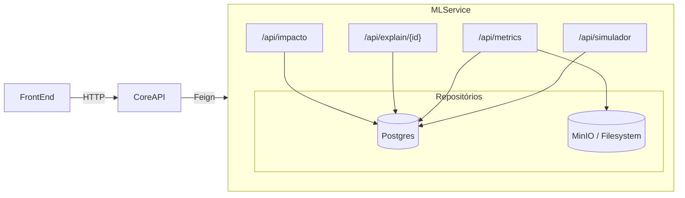

## Storytelling com Dados Reais

### Visão Geral
- `/api/impacto`, `/api/explain/{id}`, `/api/metrics` e `/api/simulador` agora consultam Postgres e modelos versionados em `ml_service/models`.
- Logs e métricas de explicabilidade permanecem auditáveis em `explainability_snapshot` e `simulacao_credito_log`.
- `metrics.json` é reconstruído pelo `ml_service/validation.py` usando dados transacionais reais.

### Preparo de Dados (Fase 0)
1. Rode o ETL (`docker compose run --rm etl`) e confirme os dados via `python -m ml_service.data_quality`.
2. Gere o grafo com `python -m ml_service.sna` (opcional: parametrizar `dt_ref`).
3. Atualize métricas: `python -m ml_service.validation`.

### Serviço ML (FastAPI)


### Flags do Front-end
- Real por padrão. Para simular mocks sem mexer no backend:
  ```js
  localStorage.setItem('useRealStorytelling', 'false');
  // ou
  window.__USE_REAL_STORYTELLING__ = false;
  ```
- Reativar dados reais:
  ```js
  localStorage.removeItem('useRealStorytelling');
  window.__USE_REAL_STORYTELLING__ = true;
  ```

### Rotas Principais
| Rota | Fonte | Observabilidade |
|------|-------|-----------------|
| `/api/impacto` | `decisao_credito`, `score_risco`, `centralidade_snapshot` | `metadados` com `fonte`, `janela_dias`, `amostra`, `atualizado_em` |
| `/api/explain/{id}` | RandomForest + SHAP (`TreeExplainer`) | Snapshot em `explainability_snapshot`, fallback documentado |
| `/api/metrics` | Validação em tempo quase real (`validation.py`) | Cache 5 min no Core API / Caffeine |
| `/api/simulador` | Score real + logging | `simulacao_credito_log` armazena payload e resposta |

### Testes
- `python -m venv .venv && . .venv/bin/activate && pip install -r ml_service/requirements.txt`
- `python -m pytest ml_service/tests` (requer Python 3.11 para rodas rodas com wheels prontos).
- `mvn test` na `core-api` (usa Testcontainers Postgres).
- `npm test -- --watch=false` (necessário `CHROME_BIN`; usar `npx playwright install --with-deps` ou Chromium headless).

### Observabilidade
- Logs estruturados no FastAPI/Spring.
- Prometheus scrape habilitado via Actuator (`/actuator/prometheus`) e FastAPI (adicionar `prometheus_client` se desejado).
- `validation.py` fornece timestamp/fonte para auditoria front-end.

